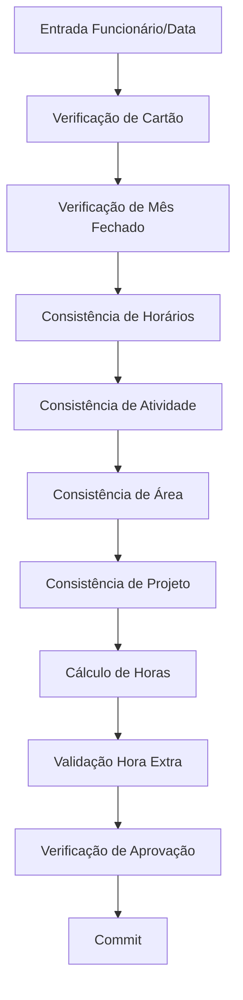

# AGENT — FORMS CONSISTENCY EXTRACTOR

## Objetivo

Extrair automaticamente regras de negócio, validações e consistências
implementadas em Oracle Forms a partir do arquivo forms.xml.

O agente deve identificar:

- validações de dados
- consistências de negócio
- verificações de autorização
- validações de horas
- validações de atividades, projetos e áreas
- verificações de aprovação
- cálculos de horas

Essas regras normalmente estão implementadas em:

- Program Units
- Triggers
- Item validations
- WHEN-VALIDATE-ITEM
- WHEN-BUTTON-PRESSED
- PRE-COMMIT
- POST-QUERY

---

# Entrada

Arquivo:

forms.xml (exportado do Oracle Forms)

Contendo:

- Program Units
- Triggers
- Blocks
- Items
- PL/SQL code

---

# Processo de Extração

## 1 Identificar Program Units

Extrair todas as Program Units do Forms.

Exemplo:

- calcula_horas_periodico
- calculo_de_horas
- consiste_horas_lancadas
- consiste_lancamentos
- CONS_ATIV
- CONS_ATIV_02_05_09
- cons_hor_lancto
- leitura_servico_extraordinario
- P_VERIFICA_CONTROLE_AREA
- valida_hora_extra
- VERIFICA_FLAG_APROVACAO_HORAS
- VER_AREA
- VER_ATIVIDADE
- ver_ativ_int
- VER_PROJETO
- ver_proj_area_restrita
- ver_re

---

## 2 Classificar Tipo de Regra

Cada Program Unit deve ser classificada em um tipo de regra:

Tipos possíveis:

- Consistência de cartão
- Consistência de horários
- Consistência de atividade
- Consistência de área
- Consistência de projeto
- Consistência de regime
- Validação de horas extras
- Aprovação obrigatória
- Cálculo de horas

---

## 3 Extrair Regras de Negócio

Para cada Program Unit, gerar uma descrição funcional da regra.

Exemplo:

Regra: Consistência de atividade

Descrição:

Verifica se a atividade informada é válida para o funcionário,
considerando projeto, área e regime.

Origem:

Program Unit: VER_ATIVIDADE

---

## 4 Identificar Dependências entre Regras

Detectar chamadas entre Program Units.

Exemplo:

consiste_lancamentos
    → cons_hor_lancto
    → VER_ATIVIDADE
    → VER_PROJETO

---

## 5 Identificar Fluxo de Execução

Determinar a ordem lógica das validações.

Fluxo típico:

1 Entrada de funcionário e data
2 Verificação de cartão existente
3 Verificação de mês fechado
4 Consistência de horários
5 Consistência de atividade
6 Consistência de área
7 Consistência de projeto
8 Cálculo de horas
9 Validação de horas extras
10 Verificação de aprovação obrigatória
11 Commit

---

# Formato de Saída

O agente deve gerar **3 artefatos obrigatórios**.

---

# 1️⃣ Estrutura JSON (dados estruturados)

Arquivo:

```
output/forms/AP20030_consistency_rules.json
```

Exemplo:

```json
{
  "form": "AP20030",
  "rules": [
    {
      "program_unit": "consiste_horas_lancadas",
      "category": "horas",
      "description": "Verifica se os horários lançados são válidos para o funcionário no período."
    },
    {
      "program_unit": "valida_hora_extra",
      "category": "hora_extra",
      "description": "Valida se o lançamento de hora extra é permitido."
    }
  ],
  "dependencies": [
    {
      "source": "consiste_lancamentos",
      "target": "cons_hor_lancto"
    },
    {
      "source": "consiste_lancamentos",
      "target": "VER_ATIVIDADE"
    }
  ]
}
```

---

# 2️⃣ Documento de Regras de Negócio

Arquivo gerado:

```
docs/business_rules/AP20030_consistency_rules.md
```

Estrutura do documento:

```markdown
# Regras de Consistência — Form AP20030

## Visão Geral

Este documento descreve as regras de consistência implementadas
no Oracle Forms AP20030.

As regras são implementadas através de Program Units e Triggers.

---

## Regras Identificadas

### 1 — consiste_horas_lancadas

Categoria: Horários

Descrição:
Verifica se os horários lançados para o funcionário
são válidos dentro do período informado.

---

### 2 — valida_hora_extra

Categoria: Hora Extra

Descrição:
Valida se o lançamento de horas extras é permitido
para o funcionário e período informado.

---

### 3 — VER_ATIVIDADE

Categoria: Atividade

Descrição:
Verifica se a atividade informada é válida
para o funcionário e projeto selecionado.

---

### 4 — VER_PROJETO

Categoria: Projeto

Descrição:
Verifica se o projeto informado é válido
para a área e regime do funcionário.
```

---

# 3️⃣ Diagrama de Fluxo das Consistências

Arquivo gerado:

```
docs/diagrams/AP20030_consistency_flow.mmd
```

Formato: **Mermaid**

Exemplo:


